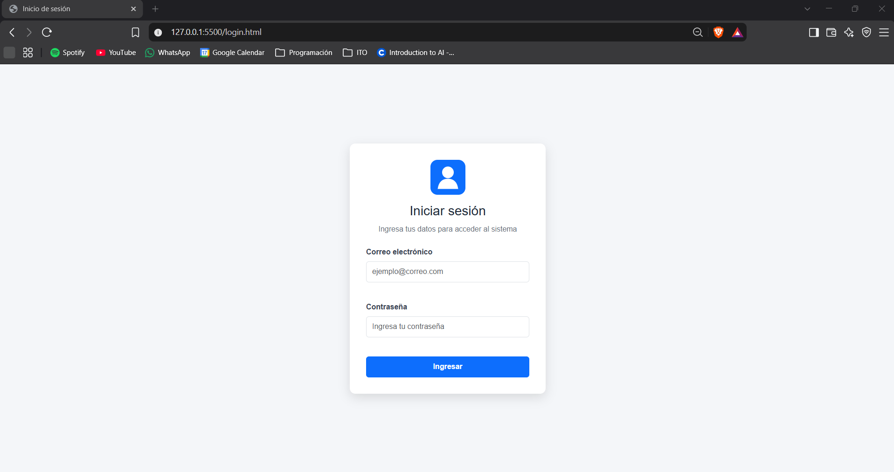
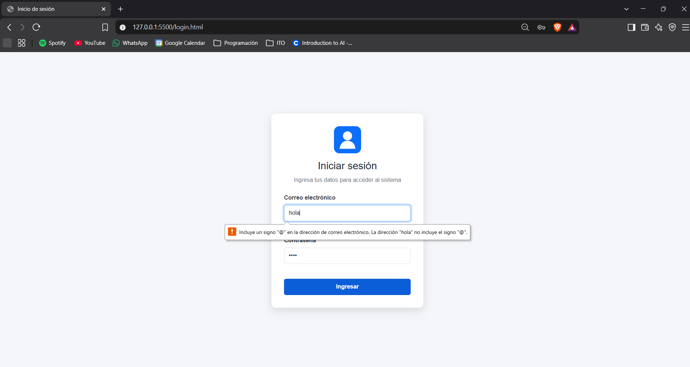
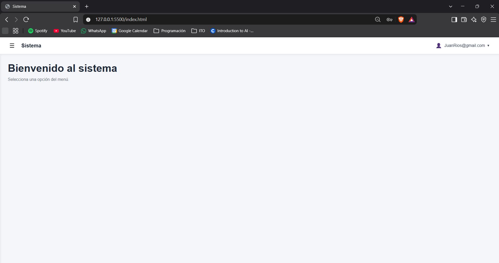
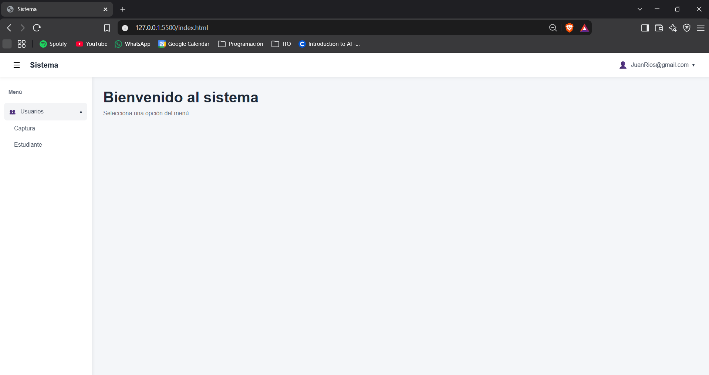
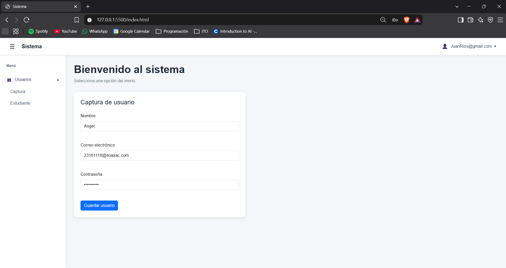
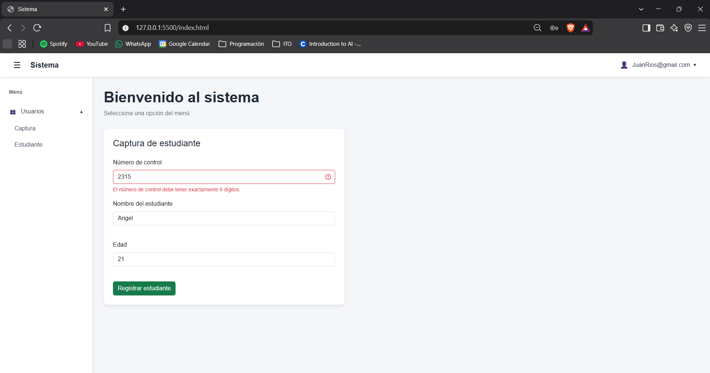
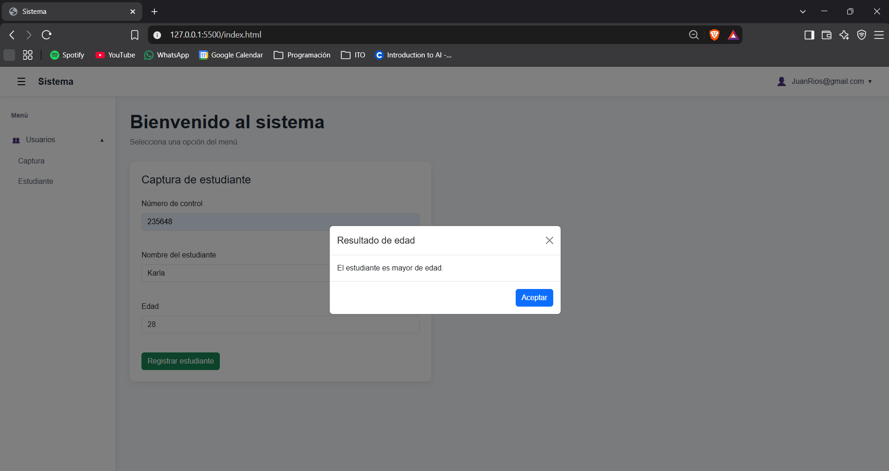
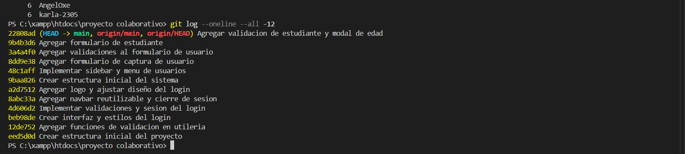

# Sistema de Login Funcional

## Programación Web

**Proyecto:** Sistema de Login Funcional  
**Materia:** Programación Web  
**Modalidad:** Equipo de 2 integrantes  

### Integrantes

- Ángel Yibán Ruiz Osante
- [NOMBRE DE TU COMPAÑERA]

---

## 1. Descripción del proyecto

El presente proyecto consiste en el desarrollo de un sistema web que simula el inicio de sesión de un usuario utilizando **HTML, CSS y JavaScript**.

El sistema está dividido en dos pantallas principales:

- `login.html`: pantalla de inicio de sesión.
- `index.html`: pantalla principal del sistema después de iniciar sesión.

El proyecto no utiliza backend. El acceso al sistema se simula mediante JavaScript y el almacenamiento temporal de información con `sessionStorage`.

Dentro de la pantalla principal se implementaron las siguientes funcionalidades:

- Navbar con el usuario que inició sesión.
- Menú desplegable para cerrar sesión.
- Sidebar con botón hamburguesa.
- Menú **Usuarios** con submenú **Captura**.
- Formulario para captura de usuarios.
- Validaciones de nombre, correo y contraseña.
- Formulario para estudiantes.
- Validación del número de control de 6 dígitos.
- Fecha de nacimiento.
- Modal para determinar si el estudiante es mayor o menor de edad.

---

## 2. Tecnologías utilizadas

### HTML5

Se utilizó para crear la estructura de las diferentes pantallas, formularios, navbar, sidebar y modal.

### CSS3

Se utilizó para personalizar el diseño del login, navbar, sidebar, formularios y diferentes elementos visuales.

### JavaScript

Se utilizó para:

- Validar los formularios.
- Manejar el inicio y cierre de sesión.
- Guardar temporalmente el usuario.
- Controlar el sidebar.
- Mostrar y ocultar elementos.
- Validar el número de control.
- Determinar la mayoría de edad.
- Controlar el modal.

### Bootstrap 5

Se utilizó **Bootstrap 5** como framework CSS para facilitar el diseño responsivo de los formularios, botones, componentes y modal.

### Git y GitHub

Se utilizaron para llevar el control de versiones y permitir que los dos integrantes trabajaran sobre el mismo proyecto.

### GitHub Pages

Se utiliza para publicar el proyecto y permitir que el sistema pueda visualizarse directamente desde Internet.

---

## 3. Estructura del proyecto

La estructura principal del proyecto es la siguiente:

```text
login-programacion-web/
│
├── login.html
├── index.html
├── README.md
│
├── css/
│   ├── login.css
│   ├── navbar.css
│   └── index.css
│
├── js/
│   ├── utileria.js
│   ├── login.js
│   ├── navbar.js
│   └── index.js
│
└── img/
    ├── logo.svg
    ├── 01-login.png
    ├── 02-validaciones-login.png
    ├── 03-sistema-principal.png
    ├── 04-sidebar-usuarios.png
    ├── 05-captura-usuarios.png
    ├── 06-formulario-estudiante.png
    ├── 07-modal-edad.png
    └── 08-commits-equipo.png
```

---

## 4. Flujo general del sistema

El flujo principal de la aplicación es:

```text
login.html
     ↓
Usuario escribe correo y contraseña
     ↓
Validaciones con JavaScript
     ↓
Se guarda el usuario en sessionStorage
     ↓
Redirección hacia index.html
     ↓
El navbar recupera y muestra el usuario
     ↓
Usuario utiliza las opciones del sistema
     ↓
Cerrar sesión
     ↓
Se elimina la información de sessionStorage
     ↓
Regreso a login.html
```

De esta manera se simula el funcionamiento básico de un sistema con autenticación sin necesidad de utilizar un backend.

---

# 5. Pantalla de inicio de sesión

El archivo `login.html` contiene la pantalla mediante la cual el usuario puede acceder al sistema.

El formulario solicita:

- Correo electrónico.
- Contraseña.

También incluye un botón **Ingresar**, encargado de ejecutar las validaciones correspondientes.

### Pantalla de login



---

## 6. Validaciones del login

Antes de permitir el acceso al sistema se comprueba que el correo electrónico y la contraseña sean válidos.

La validación del correo se realiza mediante:

```javascript
validarCorreo(correo)
```

Esta función comprueba que el texto ingresado tenga un formato válido de correo electrónico.

Ejemplo válido:

```text
usuario@gmail.com
```

Ejemplo no válido:

```text
usuario
```

Para la contraseña se utiliza:

```javascript
validarPassword(password)
```

La contraseña debe cumplir con los siguientes requisitos:

- Tener mínimo 8 caracteres.
- Contener una letra mayúscula.
- Contener una letra minúscula.
- Contener un número.
- Contener un carácter especial.

Ejemplo válido:

```text
Prueba123!
```

Si alguno de los datos no cumple con las reglas establecidas, se muestra un mensaje debajo del campo correspondiente.

### Validaciones del login



---

## 7. Librería `utileria.js`

Las funciones de validación reutilizables se encuentran almacenadas dentro del archivo:

```text
js/utileria.js
```

Entre las funciones principales se encuentran:

```javascript
validarCorreo()
soloLetras()
validarLongitud()
calcularEdad()
esMayorDeEdad()
validarPassword()
```

El objetivo de esta librería es centralizar las validaciones y permitir reutilizar las mismas funciones en diferentes partes del proyecto.

---

## 8. Manejo de sesión

El proyecto no utiliza una base de datos ni un servidor para autenticar al usuario.

Para simular el inicio de sesión se utiliza:

```javascript
sessionStorage
```

Cuando el correo y la contraseña son correctos se ejecuta:

```javascript
sessionStorage.setItem("usuario", correo);
sessionStorage.setItem("sesionActiva", "true");
```

Posteriormente el usuario es redirigido mediante JavaScript hacia:

```text
index.html
```

---

## 9. Paso del usuario del login al navbar

El correo electrónico ingresado durante el login se guarda temporalmente en `sessionStorage`.

Posteriormente se recupera mediante:

```javascript
sessionStorage.getItem("usuario");
```

De esta forma el mismo correo utilizado para iniciar sesión puede mostrarse automáticamente dentro del navbar.

Esto permite simular que el sistema reconoce al usuario que acaba de iniciar sesión.

---

# 10. Pantalla principal del sistema

Después de realizar correctamente las validaciones, el usuario es enviado desde:

```text
login.html
```

hacia:

```text
index.html
```

Esta pantalla contiene las principales funciones del sistema.

Entre ellas se encuentran:

- Navbar.
- Usuario autenticado.
- Sidebar.
- Menú Usuarios.
- Formulario de captura.
- Formulario de estudiantes.

### Pantalla principal



---

# 11. Navbar

El sistema incluye una barra superior o **navbar**.

El navbar contiene:

- Botón hamburguesa.
- Nombre o correo del usuario.
- Menú desplegable del usuario.
- Opción para salir del sistema.

La funcionalidad principal del navbar se encuentra en:

```text
js/navbar.js
```

mientras que sus estilos se encuentran en:

```text
css/navbar.css
```

El correo mostrado corresponde al mismo que fue almacenado durante el inicio de sesión.

---

## 12. Cerrar sesión

Al hacer clic sobre el nombre o correo del usuario se despliega un menú que contiene la opción:

```text
Salir del sistema
```

Cuando se selecciona esta opción, se eliminan los datos almacenados durante la sesión:

```javascript
sessionStorage.removeItem("usuario");
sessionStorage.removeItem("sesionActiva");
```

Finalmente, el navegador redirige nuevamente hacia:

```text
login.html
```

De esta forma se simula correctamente el cierre de sesión.

---

# 13. Sidebar

Dentro de la pantalla principal se implementó un menú lateral o **sidebar**.

Este menú puede abrirse y cerrarse mediante el botón hamburguesa ubicado en el navbar.

Dentro del sidebar se encuentra la opción:

```text
Usuarios
```

Al seleccionarla se muestra el submenú:

```text
Captura
```

### Sidebar y menú Usuarios



---

# 14. Menú Usuarios - Captura

Al seleccionar:

```text
Usuarios → Captura
```

se muestra un formulario destinado al registro de información de un usuario.

El formulario contiene los siguientes campos:

```text
Nombre
Correo electrónico
Contraseña
```

Los datos ingresados son validados utilizando JavaScript y las funciones disponibles en `utileria.js`.

### Formulario de captura de usuarios



---

## 15. Validaciones del formulario de usuario

Dentro del formulario de captura también se realizan diferentes validaciones.

Para validar el correo se utiliza:

```javascript
validarCorreo()
```

Para validar la contraseña se utiliza:

```javascript
validarPassword()
```

También se verifica que el nombre ingresado tenga un formato correcto.

Si alguno de los campos no cumple con las condiciones establecidas, el sistema muestra un mensaje indicando el problema.

---

# 16. Formulario de estudiante

El sistema también incluye un formulario destinado al registro de estudiantes.

Entre los datos solicitados se encuentran:

```text
Nombre del estudiante
Número de control
Fecha de nacimiento
```

El formulario realiza diferentes validaciones antes de aceptar la información.

### Formulario de estudiante



---

# 17. Validación del número de control

Uno de los requisitos del formulario de estudiantes es comprobar el número de control.

El número debe contener exactamente:

```text
6 dígitos
```

Ejemplo correcto:

```text
123456
```

Ejemplos incorrectos:

```text
123
1234567
ABC123
```

Si el valor no cumple con el formato esperado, el sistema muestra un mensaje de error.

Esto permite evitar que se registren números de control con una longitud incorrecta.

---

# 18. Modal de edad

El formulario del estudiante también solicita su fecha de nacimiento.

Mediante las funciones de la librería de utilidades se puede calcular la edad y determinar si el estudiante tiene 18 años o más.

Entre las funciones relacionadas se encuentran:

```javascript
calcularEdad()
```

y:

```javascript
esMayorDeEdad()
```

Dependiendo de la fecha de nacimiento ingresada, el sistema muestra mediante un **modal** si el estudiante es mayor o menor de edad.

Ejemplo:

```text
El estudiante es mayor de edad.
```

o:

```text
El estudiante es menor de edad.
```

### Modal de validación de edad



---

# 19. Métodos principales

## `validarCorreo()`

Valida que el texto ingresado tenga un formato correcto de correo electrónico.

```javascript
validarCorreo(correo)
```

---

## `soloLetras()`

Comprueba que un texto contenga únicamente caracteres permitidos para un nombre.

```javascript
soloLetras(texto)
```

---

## `validarLongitud()`

Permite comprobar que un valor tenga una determinada cantidad de caracteres.

```javascript
validarLongitud(numero, maxLongitud)
```

---

## `calcularEdad()`

Calcula la edad de una persona utilizando su fecha de nacimiento.

```javascript
calcularEdad(fechaNacimiento)
```

---

## `esMayorDeEdad()`

Determina si una persona tiene 18 años o más.

```javascript
esMayorDeEdad(fechaNacimiento)
```

---

## `validarPassword()`

Comprueba que una contraseña cumpla con los requisitos de seguridad definidos.

```javascript
validarPassword(password)
```

---

# 20. Proceso de creación

## Paso 1. Creación del repositorio

Se creó un repositorio público en GitHub.

Posteriormente se agregó al segundo integrante como colaborador para que ambos pudieran trabajar directamente sobre el mismo repositorio.

---

## Paso 2. Creación de la estructura

Se crearon las carpetas principales:

```text
css/
js/
img/
```

Esto permitió mantener separados los estilos, scripts e imágenes utilizados por el proyecto.

---

## Paso 3. Creación de la librería de utilidades

Se creó:

```text
js/utileria.js
```

para almacenar las funciones de validación reutilizables.

---

## Paso 4. Creación del login

Se desarrollaron:

```text
login.html
css/login.css
```

para construir y diseñar la pantalla de acceso.

---

## Paso 5. Programación del login

Se creó:

```text
js/login.js
```

para implementar:

- Validación de correo.
- Validación de contraseña.
- Manejo de errores.
- Almacenamiento del usuario.
- Redirección hacia el sistema.

---

## Paso 6. Manejo de sesión

Se implementó `sessionStorage` para almacenar temporalmente:

```text
usuario
sesionActiva
```

Esto permite mantener la información mientras el usuario utiliza el sistema.

---

## Paso 7. Creación del navbar

Se desarrollaron:

```text
js/navbar.js
css/navbar.css
```

para crear la barra superior, mostrar el usuario y permitir cerrar sesión.

---

## Paso 8. Creación de la pantalla principal

Se desarrollaron:

```text
index.html
css/index.css
js/index.js
```

Estos archivos contienen la estructura y funcionamiento principal del sistema.

---

## Paso 9. Implementación del sidebar

Se agregó un menú lateral controlado mediante un botón hamburguesa.

Dentro del menú se agregó:

```text
Usuarios
└── Captura
```

---

## Paso 10. Formulario de captura de usuarios

Se creó un formulario con los campos:

```text
Nombre
Correo
Contraseña
```

También se integraron las funciones de validación correspondientes.

---

## Paso 11. Formulario de estudiantes

Se implementó un segundo formulario para estudiantes.

Este incluye:

```text
Nombre
Número de control
Fecha de nacimiento
```

---

## Paso 12. Validación de estudiante

Se implementó la comprobación del número de control y la validación de la fecha de nacimiento.

---

## Paso 13. Modal de edad

Se implementó un modal para mostrar si el estudiante es mayor o menor de edad.

---

## Paso 14. Pruebas del sistema

Finalmente se realizaron pruebas del flujo completo:

```text
Login
   ↓
Validaciones
   ↓
Inicio de sesión
   ↓
Index
   ↓
Navbar
   ↓
Sidebar
   ↓
Usuarios / Captura
   ↓
Formulario estudiante
   ↓
Modal de edad
   ↓
Cerrar sesión
```

---

# 21. Trabajo colaborativo

El proyecto fue desarrollado mediante Git y GitHub por los dos integrantes del equipo.

Cada integrante realizó sus propios cambios y los registró mediante commits independientes.

Durante la revisión del historial se obtuvo:

```text
6  AngelOxe
6  karla-2305
```

Esto representa una participación de aproximadamente:

```text
50% / 50%
```

cumpliendo con el rango solicitado de participación de entre **40/60 y 60/40**.

### Historial de participación



---

# 22. Repositorio de GitHub

El código fuente del proyecto se encuentra disponible en el siguiente repositorio:

```text
https://github.com/AngelOxe/login-programacion-web
```

---

# 23. GitHub Pages

El proyecto será publicado mediante GitHub Pages para poder ejecutar el flujo completo directamente desde Internet.

Enlace:

```text
[AGREGAR ENLACE DE GITHUB PAGES]
```

---

# 24. Flujo completo

El funcionamiento final del proyecto puede resumirse de la siguiente manera:

```text
Usuario abre login.html
        ↓
Ingresa correo y contraseña
        ↓
Se ejecutan las validaciones
        ↓
Datos correctos
        ↓
Se crea la sesión
        ↓
Redirección a index.html
        ↓
El navbar muestra el usuario
        ↓
El usuario puede utilizar el sidebar
        ↓
Usuarios → Captura
        ↓
Registro y validación de usuarios
        ↓
Formulario de estudiantes
        ↓
Validación de número de control
        ↓
Validación de edad mediante modal
        ↓
Salir del sistema
        ↓
Se elimina la sesión
        ↓
Regreso a login.html
```

---

# 25. Resultado final

El proyecto permite simular correctamente el acceso a un sistema mediante un login desarrollado con HTML, CSS y JavaScript.

Se implementaron las funcionalidades solicitadas:

- Validación de correo y contraseña.
- Redirección entre `login.html` e `index.html`.
- Manejo de sesión mediante `sessionStorage`.
- Visualización del usuario en el navbar.
- Sidebar con botón hamburguesa.
- Menú Usuarios con submenú Captura.
- Formulario para captura de usuarios.
- Formulario para estudiantes.
- Validación del número de control.
- Modal para determinar la mayoría de edad.
- Cierre de sesión.

También se utilizó Git y GitHub para desarrollar el proyecto colaborativamente, manteniendo una participación equilibrada entre ambos integrantes.

De esta manera se cumplieron los requisitos funcionales y de documentación establecidos para la actividad.